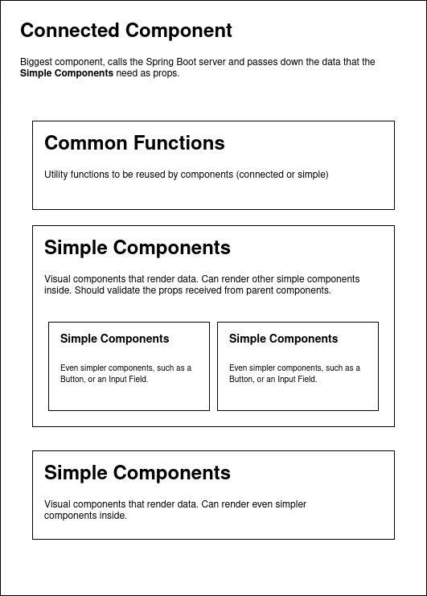

# AgroHub

# What is AgroHub?
AgroHub is a marketplace for Puertorrican farmers. 

# What is our mission?
Our goal is to allow individual farmers and small organizations grow
economically and to scale up as much as they can in order to provide 
by selling their products via the Internet. In addition, we'd like to 
provide the community of Puerto Rico quality agricultural products. 

# Current Situation
Individual Farmers can only sell at certain times, since agricultural products
require high maintenance. Also, supermarkets and other chains require a high
production-rate that individual Farmers cannot meet. Given this, a new strategy
is rising, in which a group of Farmers act as a single entity or Organization 
with resources like storage, refrigeration, maintenance, etc. and *buy* the products
from other individual Farmers in order to redistribute. However, the
redistribution process requires tons of effort, e.g. determining how much a
single Farmer sold, scaling for more customers, etc.

# Solution Approach
Our solution is to satisfy 3 types of users:
1. Organizations
2. Farmers
3. Customers

We should provide Organizations the following *features*:
- Contact other individual Farmers
- Post their products for selling
- Automation for the processes of
    - inventory 
    - calculate individual farmer earnings
    - transactions

We should provide Farmers the following *features*:
- Contact Organizations
- Keep track of their products
- Keep track of their earnings

We should allow Customers to:
- Buy products
- Reviewing 

# Technical Description
Tech-Stack:
- ReactJS
- Spring Boot
- PostgreSQL
- Heroku

## Frontend
We use the ReactJS Framework in order to provide the Client interface for our
users. The following diagram explains the architecture for the Frontend:

## Backend
We use the Spring Boot Framework to build the server which provides the data
stored in the PostgreSQL database.
